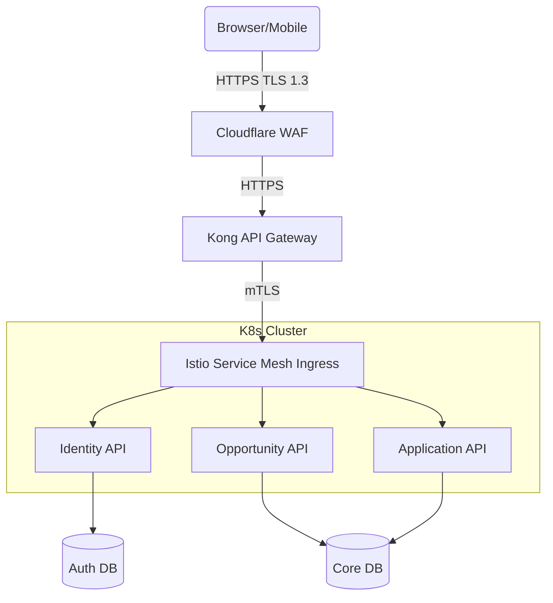
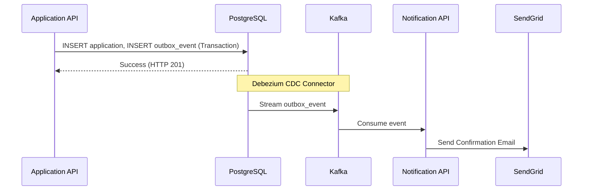

# Enterprise API Architecture Design
## KICD Attachment Management System

---

### 1. Executive Summary
The KICD Attachment Management System API is a cloud-native, RESTful platform engineered to manage industrial attachments at a national scale. It serves as the primary interface for students, HR officers, and administrators, handling up to 100,000 peak users (Tier 2).

**Key Architectural Decisions:**
- **Stateless Auth:** JWTs stored in HTTP-Only cookies with Redis-backed revocation for seamless horizontal scaling.
- **Async Event-Driven Core:** Outbox pattern over Kafka to decouple core application writes from email notifications and analytics.
- **Zero-Trust Security:** Istio service mesh enforcing mTLS internally, with Kong acting as the primary API Gateway handling multi-dimensional rate-limiting and WAF integration.

**Risk Posture:**
The system processes Kenyan citizens' PII (Kenya DPA 2019 scope). Therefore, all PII is encrypted at rest via AES-256-GCM using Vault Transit keys, and all APIs strictly enforce JWT claim validation and RBAC.

---

### 2. Architectural Decision Records (ADRs)

| ID | Status | Date | Context | Decision | Consequences | Alternatives Rejected |
|---|---|---|---|---|---|---|
| ADR-001 | Approved | 2026-07 | API Paradigm | Use REST (HTTP/JSON) for core APIs. | Easy integration with Next.js frontend, highly cacheable. | GraphQL (overkill for fixed data structures), gRPC (poor browser support without grpc-web). |
| ADR-002 | Approved | 2026-07 | Async Comms | Outbox Pattern + Kafka | Guarantees at-least-once delivery of notifications. | Direct SMTP calls (high latency, breaks on failure). |
| ADR-003 | Approved | 2026-07 | Token Storage | HTTP-Only Cookies | Prevents XSS token exfiltration. | LocalStorage (high XSS risk). |
| ADR-004 | Approved | 2026-07 | Document Uploads | S3 Presigned URLs | Offloads binary transfer from API nodes to S3 edge. | Multipart Form API (exhausts node memory). |

---

### 3. Architecture Diagrams

#### 3.1 API Gateway Architecture

*The API Gateway acts as the first line of defence, handling rate limiting, JWT validation (via cached JWKS), and routing traffic into the Istio service mesh.*

#### 3.2 Event Flow Diagram

*The Outbox pattern ensures the API response is not delayed by external SMTP limits.*

---

### 4. API Endpoint Catalogue

### POST /v1/auth/login

**Description:** Authenticates a user and issues HTTP-Only JWT cookies.
**Auth:** None
**Rate Limit:** 5 requests per minute per IP.
**Idempotency:** N/A (Read/Auth action).

#### Request
Headers:
  X-Request-ID: <uuid>
  Content-Type: application/json

Body:
```json
{
  "email": "student@example.com",
  "password": "SecurePassword123!"
}
```

#### Responses
200 OK:
```json
{
  "status": "success",
  "data": {
    "user": { "id": 1, "role": "STUDENT", "email": "student@example.com" }
  },
  "meta": { "request_id": "uuid", "timestamp": "2026-07-15T10:00:00Z" }
}
```
*(Sets `Set-Cookie: access_token=...; HttpOnly; Secure; SameSite=Strict`)*

401 Unauthorized: Invalid credentials.

---

### GET /v1/opportunities

**Description:** Lists active attachment opportunities.
**Auth:** None (Publicly visible)
**Rate Limit:** 100 requests per minute per IP.

#### Request
Headers:
  X-Request-ID: <uuid>
Query Parameters:
  page (integer, optional, default: 1)
  status (string, optional, default: PUBLISHED)

#### Responses
200 OK:
```json
{
  "status": "success",
  "data": [
    {
      "id": 101,
      "title": "Software Engineering Intern",
      "department": "IT",
      "deadline": "2026-08-01T00:00:00Z",
      "coverImageUrl": "https://s3.../image.png"
    }
  ],
  "meta": { "total_pages": 5, "current_page": 1 }
}
```

---

### POST /v1/applications

**Description:** Submits a student application to an opportunity.
**Auth:** Bearer Token via Cookie (Role: STUDENT)
**Rate Limit:** 10 requests per minute per User ID.
**Idempotency:** Required. Prevents duplicate applications if user double-clicks.

#### Request
Headers:
  X-Idempotency-Key: <uuid>
  X-Request-ID: <uuid>
  Content-Type: application/json

Body:
```json
{
  "opportunityId": 101,
  "coverLetterText": "I am writing to apply..."
}
```

#### Responses
201 Created:
```json
{
  "status": "success",
  "data": { "applicationId": 505, "status": "PENDING" },
  "meta": { "request_id": "uuid" }
}
```

409 Conflict: Application already exists for this opportunity.

---

### 5. Security Architecture Specification

#### 5.1 Authentication & Authorisation
- **Auth:** Stateless JWT. Access Token (15m TTL), Refresh Token (7d TTL). Stored in `Secure, HttpOnly, SameSite=Strict` cookies.
- **Authorisation:** Evaluated at the Gateway (Kong OIDC plugin for gross validation) and at the method level in Spring Boot (`@PreAuthorize("hasAuthority('STUDENT')")`).

#### 5.2 Encryption Matrix
- **In Transit:** TLS 1.3 at Edge -> Gateway. mTLS 1.3 Gateway -> Pods.
- **At Rest:** AWS KMS CMK encrypts RDS storage.
- **Application Level:** Student Name, Phone, and National ID are encrypted using AES-256-GCM via HashiCorp Vault's Transit Engine prior to database insertion.

#### 5.3 Threat Protection
- **DDoS/Bots:** Cloudflare Rate Limiting and Bot Management.
- **Injection:** Spring Data JPA parameterised queries; strict JSON Schema validation on input DTOs.
- **CSRF:** Next.js Server Actions using SameSite cookies mitigate CSRF without needing a double-submit token.

---

### 6. Scalability Architecture Specification

#### 6.1 Horizontal Scaling
- Pods are entirely stateless. Kubernetes Horizontal Pod Autoscaler (HPA) scales API deployments based on CPU > 70% and Memory > 80%.
- Notification workers scale via KEDA based on the Kafka `application-events` topic lag.

#### 6.2 Caching Strategy
- **CDN:** Opportunity images and static assets cached at Cloudflare.
- **DB Cache:** Hibernate L2 cache configured using Redis for read-heavy, rarely-changing entities (e.g., Departments).

---

### 7. Reliability & Resilience Specification

- **Availability Target:** 99.95% (Max downtime 21.9 min/month).
- **Circuit Breakers:** Resilience4j wraps all S3 SDK calls and SendGrid HTTP calls. 
  - *Config:* 50% failure rate threshold, 10s wait duration in open state.
- **Retry:** Exponential backoff for Kafka consumers handling transient SMTP errors (max 5 retries, then push to Dead Letter Queue `email-dlq`).

---

### 8. Observability Specification

- **Logs:** FluentBit sidecars ship JSON formatted logs to OpenSearch. Passwords and JWTs are scrubbed.
- **Metrics:** Prometheus scrapes `/actuator/prometheus`. RED metrics (Rate, Errors, Duration) visualized in Grafana.
- **Traces:** OpenTelemetry Java Agent auto-instruments all HTTP and DB calls, propagating the `X-Request-ID` / `trace_id` through Kafka headers to the Notification service.

---

### 9. Governance & Versioning Policy
- **Versioning:** URI Path Versioning (`/api/v1/`).
- **Deprecation:** Beta APIs undergo 3 months of feedback. Deprecated endpoints emit a `Sunset: <Date>` HTTP header for 6 months before responding with `410 Gone`.

---

### 10. Data Architecture Specification

- **Database:** Amazon RDS PostgreSQL (Multi-AZ).
- **Isolation:** Application Service and Opportunity Service share the core DB but use separate schema boundaries logically.
- **Transactions:** Local ACID transactions for standard CRUD. Distributed workflows (Application -> Email) use the transactional Outbox pattern to ensure eventual consistency.

---

### 11. External Integration Catalogue

#### SendGrid (Email Service)
- **Interface:** `EmailProvider` interface in Java.
- **Auth:** API Key injected via Vault sidecar.
- **Failover:** If SendGrid API returns 5xx consistently (Circuit Breaker OPEN), messages route to a standby AWS SES implementation.

#### AWS S3 (Document Storage)
- **Interface:** `StorageProvider`.
- **Auth:** IAM Roles for Service Accounts (IRSA) via Kubernetes OIDC. No long-lived access keys used.

---

### 12. Deployment Runbook

#### CI/CD Pipeline (GitHub Actions -> ArgoCD)
1. **Lint/Test:** Maven tests + JaCoCo coverage (Gate: >80%).
2. **SAST/Secrets:** SonarQube scan + Gitleaks.
3. **Build:** Docker build using `eclipse-temurin:17-jre-alpine` base.
4. **Scan Image:** Trivy scan (Gate: 0 CRITICAL).
5. **Push & Sign:** Push to ECR, sign with Cosign.
6. **Deploy:** Update Helm values repository -> ArgoCD detects drift and synchronises Staging.
7. **Production:** Manual approval triggers ArgoCD sync to Prod namespace (Rolling update).

---

### 13. Architecture Maturity Assessment

| Framework | Assessment | Gap | Recommendation |
|---|---|---|---|
| OWASP API Security | Compliant | Rate limiting is IP-based. | Implement Kong multi-dimensional rate limiting (IP + JWT sub). |
| AWS Well-Architected | Strong | RDS is Multi-AZ but single region. | Implement Cross-Region Read Replicas for DR. |

---

### 14. Risk Register

| Risk ID | Description | Severity | Probability | Mitigation | Owner |
|---|---|---|---|---|---|
| RSK-01 | Exposure of S3 buckets containing student ID documents. | Critical | Low | S3 Block Public Access enabled. IAM policies restrict read to presigned URLs only. | Cloud Architect |
| RSK-02 | Notification Kafka lag during application deadlines causing timeout. | Medium | Medium | KEDA autoscaling based on consumer group lag rather than CPU. | Platform Engineer |

---

### 15. Appendices

**Assumption Log:**
- AL-01: Multi-region active-active deployment is not required for Tier 2 target scale (Active-passive DR is sufficient).
- AL-02: Next.js frontend will handle CSRF protection natively via Server Actions, meaning the API doesn't need to issue CSRF tokens for API routes.

**Compliance Matrix (Kenya DPA):**
- *Right to Access:* Fulfilled via GET `/v1/profiles/me` and GET `/v1/applications`.
- *Right to Erasure:* Fulfilled via crypto-shredding (deleting the Vault Transit DEK associated with the user), rendering the DB cyphertext unreadable.
