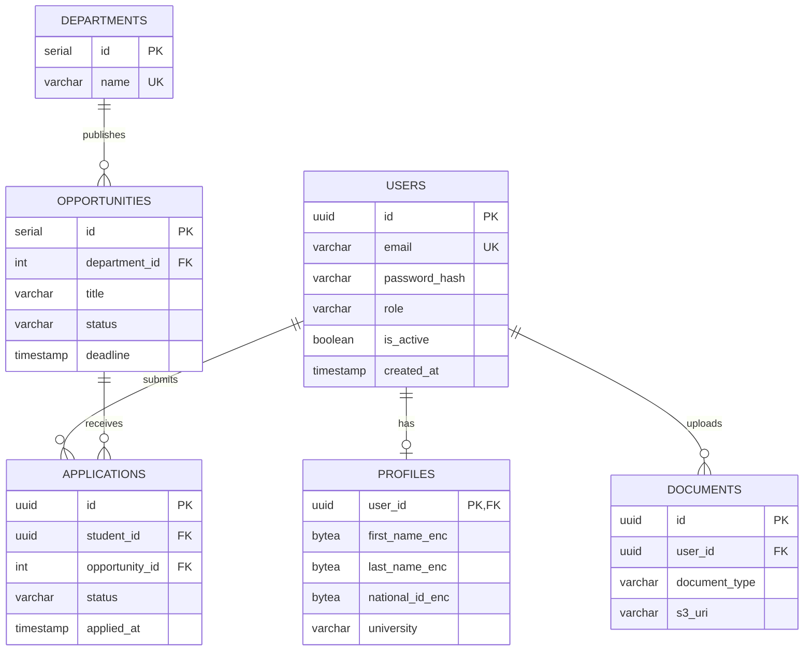
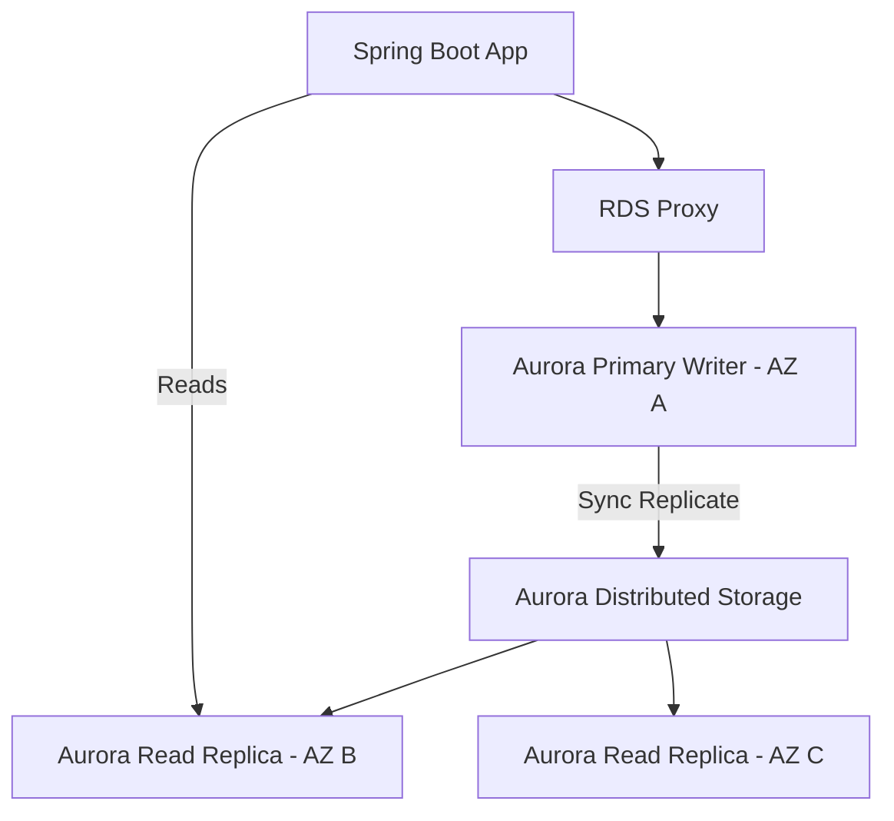

# Enterprise Database Architecture Design
## KICD Attachment Management System

---

## 1. Executive Summary
The KICD Attachment Management System Database Architecture is engineered to provide a highly available, robust, and secure data platform compliant with the Kenya DPA 2019. Supporting up to 100,000 peak users, the architecture utilises a polyglot persistence strategy anchored by **Amazon Aurora PostgreSQL (Multi-AZ)** for transactional integrity, **Redis Cluster** for low-latency session and cache management, and **Kafka** for event-driven decoupled analytics and notifications.

### Identified Assumptions & Risks
- **Assumption:** The database will not process credit card payments natively (Out of scope).
- **Risk:** High burst read/write during attachment application deadlines. *Mitigated by RDS Proxy connection pooling and CQRS caching via Redis.*
- **Risk:** PII exposure. *Mitigated by AES-256-GCM application-layer DEK encryption on sensitive fields (National ID, Phone).*

---

## 2. Architecture Decision Records (ADRs)

| ID | Date | Context | Decision | Consequences |
|---|---|---|---|---|
| ADR-001 | 2026-07 | Core Relational Store | Amazon Aurora PostgreSQL | Provides cross-AZ HA, read replicas, and fast failover. Native JSONB support enables flexible attribute storage. |
| ADR-002 | 2026-07 | Cache & Session | Redis Cluster (ElastiCache) | Ensures JWT token revocation checks are sub-millisecond. |
| ADR-003 | 2026-07 | Document Storage | AWS S3 | DB size is kept minimal; DB only stores S3 URIs. |
| ADR-004 | 2026-07 | Cross-Domain Sync | Transactional Outbox + Debezium | Guarantees event delivery without distributed 2PC transactions. |

---

## 3. Data Models

### 3.1 Entity Relationship Diagram (ERD)

---

## 4. Physical Database Design

### 4.1 Schema Strategy
The database utilizes a **single database, multi-schema** approach to separate domains logically while allowing foreign keys where necessary (avoided between microservices, but used within modular monoliths).
- Schema `identity`: Tables `users`, `roles`.
- Schema `hr`: Tables `opportunities`, `departments`.
- Schema `student`: Tables `profiles`, `applications`, `documents`.
- Schema `outbox`: Tables `outbox_events` (for Debezium Kafka Connector).

### 4.2 Indexing & Performance
- **Primary Keys:** UUIDv7 used for users, applications, and documents to prevent ID guessing (Insecure Direct Object Reference) and prevent b-tree fragmentation.
- **Indexes:** 
  - B-Tree index on `opportunities(status, deadline)` for fast filtering.
  - Partial Unique Index on `applications(student_id, opportunity_id) WHERE status != 'REJECTED'` to prevent duplicate active applications.
- **Connection Pooling:** AWS RDS Proxy placed in front of Aurora to multiplex connections, protecting the database from connection exhaustion during spikes.

---

## 5. Partitioning Strategy

Given the Tier 2 target (100k users), horizontal sharding is premature. However, table partitioning is applied to unbounded growth tables:

- **`outbox_events`:** Time-based declarative partitioning by `DATE`. A cron job drops partitions older than 7 days once Debezium confirms consumption.
- **`applications`:** Hash partitioned by `opportunity_id` to distribute heavy write loads evenly across database blocks during a specific opportunity's deadline rush.

---

## 6. High-Scale Architecture & Replication

### Replication Topology

- **Write Operations:** Routed to the Primary instance via RDS Proxy.
- **Read Operations:** Non-critical reads (e.g., student browsing opportunities) are routed to Read Replicas.

---

## 7. Consistency & Transactions

- **ACID Transactions:** Maintained for all operations within a bounded context (e.g., updating profile and uploading a document record).
- **Eventual Consistency:** Used between domains. Example: An application submission writes to `applications` and `outbox_events` in one transaction. The Notification Service consumes the event seconds later to send an email.
- **Isolation Level:** `READ COMMITTED` by default. `SERIALIZABLE` used for state-transition operations (e.g., HR approving an application to prevent race conditions).

---

## 8. Security Architecture

- **Encryption at Rest:** Aurora encrypted using AWS KMS Customer Managed Keys (CMKs).
- **Field-Level Encryption:** PII (Name, Phone, ID) stored as `bytea`. Application decrypts dynamically using HashiCorp Vault Transit Engine. If a DB dump is leaked, PII remains encrypted.
- **RBAC & Least Privilege:** Application connects using IAM authentication (short-lived tokens), not static passwords. Separate DB roles for `app_read`, `app_write`, and `migrations`.

---

## 9. Resilience & Disaster Recovery

- **RTO:** 15 Minutes (Aurora automatic failover to Read Replica).
- **RPO:** 5 Minutes (Continuous WAL streaming to S3).
- **Backups:** Daily automated snapshots retained for 35 days. Cross-region snapshot copy enabled for Region failure tolerance.
- **Chaos Engineering:** Monthly simulated failover events triggering Aurora primary reboot to ensure application reconnects gracefully via RDS Proxy.

---

## 10. Data Lifecycle Management

- **Hot Data:** Active opportunities, pending applications (Aurora DB).
- **Warm Data:** Closed opportunities, rejected applications. Moved to cold schemas after 1 year.
- **Archival:** Records older than 3 years exported to Parquet format in S3 via AWS Glue and deleted from Aurora to reclaim storage.
- **Right to Erasure (GDPR/KDPA):** Deleting the Vault DEK associated with the `user_id` instantly renders all field-level encrypted PII unrecoverable (Crypto-shredding).

---

## 11. Analytics & Reporting Architecture

- **Operational Reporting:** Lightweight aggregation views executed against the Aurora Read Replica.
- **Data Lakehouse:** Debezium streams CDC data from Kafka to an AWS S3 Data Lake (Apache Iceberg format). Amazon Athena provides serverless SQL querying for complex HR analytics without impacting operational DB performance.

---

## 12. Observability

- **Metrics:** Datadog Database Monitoring tracks query execution time, active connections, cache hit ratios, and deadlocks.
- **Logging:** Postgres `log_min_duration_statement` set to 500ms to log slow queries.
- **Tracing:** APM trace IDs are injected as SQL comments (`/* traceparent=... */`) by Hibernate to correlate specific slow queries to frontend user actions.

---

## 13. External Integration Architecture (Pluggable)

- **S3 Storage:** Database stores `s3_uri`. Migration to Azure Blob or GCP requires only changing the URL parser in the application.
- **Email/SMS:** Handled entirely out-of-band by the Kafka consumer. Database has zero knowledge of the external provider.

---

## 14. Database Governance

- **Migrations:** Flyway used for schema versioning.
- **Rule:** No `DROP COLUMN` commands allowed. Columns must be deprecated, nulled, and removed in a subsequent release to ensure zero-downtime deployments.
- **Naming Conventions:** All tables plural `snake_case`. Foreign keys `table_id`. Timestamps `created_at`, `updated_at`.

---

## 15. Architecture Maturity Review

### Strengths
- **Decoupled:** Outbox pattern prevents distributed transaction locks.
- **Secure:** Field-level encryption protects PII even from DBAs.
- **Scalable:** Read replicas and RDS proxy prepare the system for sudden 10x traffic spikes.

### Future Roadmap (Tier 3 to Tier 4)
- Migrate to **Amazon Aurora Serverless v2** to handle extreme diurnal traffic spikes (high daytime load, zero nighttime load) cost-effectively.
- Implement CockroachDB if multi-region active-active writes are mandated by future East African expansion requirements.
