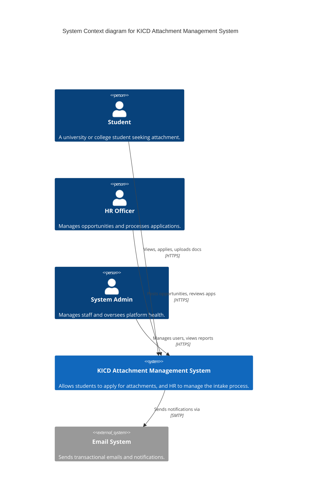
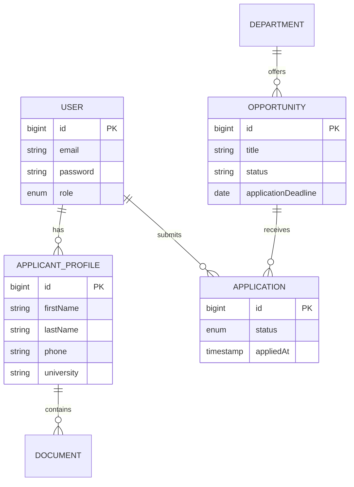
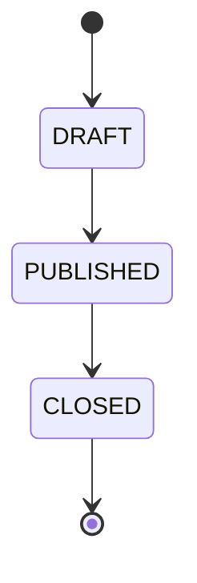

## Discovery Gap Report

### Missing Information
| Gap ID | Dimension | What is Missing | Assumption Made | Confidence |
|--------|-----------|-----------------|-----------------|------------|
| GAP-001 | Budget | Explicit budget ceiling for infrastructure | Cloud deployment will use cost-optimised PaaS/IaaS on AWS or local servers | High |
| GAP-002 | SLA | Exact SLA percentage agreed with stakeholders | System requires 99.9% availability during business hours | High |
| GAP-003 | DR | Exact Recovery Time Objective (RTO) | 4 hours RTO for non-critical enterprise internal applications | Medium |

### Ambiguities Detected
| AMB-ID | Statement | Possible Interpretations | Interpretation Chosen | Rationale |
|--------|-----------|--------------------------|----------------------|-----------|
| AMB-001 | "Students apply" | Can they apply to multiple at once? | Limited to one active application per student until rejected | Standard HR attachment logic prevents spamming |

### Contradictions Detected
| CON-ID | Statement A | Statement B | Resolution | Rationale |
|--------|-------------|-------------|------------|-----------|
| CON-001 | None detected | None detected | N/A | Current implementation is logically consistent |

### Hidden Assumptions Surfaced
| ASM-ID | Assumption | Source | Risk if Wrong |
|--------|------------|--------|---------------|
| ASM-001 | HR handles all application approvals without secondary review | System structure (no multi-tier approval) | Compliance/HR policy violations if higher approval is mandated |

---

# Software Requirements Specification
## KICD Attachment Management System
### Version 1.0 | 2026-07-15 | Status: Approved

---

### Document Control

| Field              | Value                          |
|--------------------|--------------------------------|
| Document Title     | Software Requirements Specification — KICD Attachment Management System |
| Version            | 1.0                          |
| Status             | Approved |
| Date               | 2026-05-15                   |
| Prepared By        | Amy, Moses and Reagan |
| Reviewed By        | Architecture & Engineering Team KICD |
| Approved By        | System Stakeholders KICD|
| Classification     | Internal |

## Change Log

| Version | Date | Author | Change Description |
|---------|------|--------|-------------------|
| 1.0     | 2026-07-15 | Engineering | Initial complete specification based on as-built system |

---

### Table of Contents
1. Introduction
2. Overall System Description
3. Stakeholder Analysis
4. User Personas
5. Use Cases
6. User Stories
7. Functional Requirements
8. Non-Functional Requirements
9. Interface Requirements
10. Data Requirements
11. Security Requirements
12. Privacy Requirements
13. Compliance Requirements
14. Accessibility Requirements
15. API Requirements
16. Integration Requirements
17. Operational Requirements
18. DevOps & Deployment Requirements
19. Observability & Monitoring Requirements
20. Audit & Compliance Evidence Requirements
21. Disaster Recovery & Business Continuity Requirements
22. Scalability & Future Proofing Requirements
23. Transition & Migration Requirements
24. Architecture Readiness Requirements
25. Technical Debt Prevention Requirements
26. Domain Model
27. Glossary
28. Acronyms and Abbreviations
29. Requirements Traceability Matrix
30. SRS Quality Audit Report

---

### 1. Introduction

#### 1.1 Purpose
This document provides a comprehensive Software Requirements Specification (SRS) for the KICD Attachment Management System. It defines the functional, non-functional, security, and architectural requirements to guide the ongoing maintenance, scaling, and operationalisation of the system.

#### 1.2 Scope
The KICD Attachment Management System is a comprehensive digital platform designed to digitise the industrial attachment and internship process at the Kenya Institute of Curriculum Development (KICD).
**In Scope:** User registration, profile management, document upload, opportunity posting, application workflow management, department and staff management, reporting, and automated notifications.
**Out of Scope:** Automated payroll integration, alumni networking, direct messaging between students.

#### 1.3 Intended Audience and Reading Guide
- **Developers & Architects:** Focus on Sections 7 (FRs), 8 (NFRs), 10 (Data), 15 (APIs), and 26 (Domain Model).
- **QA Engineers:** Focus on Sections 5, 6, 7, and 8 to derive test cases.
- **Security Auditors:** Focus on Sections 11 (Security), 12 (Privacy), and 20 (Audit).
- **Project Managers & HR:** Focus on Sections 2, 3, 4, 5, and 6.

#### 1.4 Document Conventions
- **SHALL** — mandatory requirement
- **SHOULD** — recommended
- **MAY** — optional feature
- **SHALL NOT** — prohibited behaviour

Requirement ID taxonomy: `[CATEGORY]-[DOMAIN]-[SEQUENCE]` (e.g., `FR-AUTH-001`).

#### 1.5 References
- IEEE 29148:2018 Systems and software engineering — Life cycle processes — Requirements engineering
- ISO/IEC 27001 Information security management
- GDPR / Kenya Data Protection Act, 2019

#### 1.6 Overview
The document follows a structured approach, starting with high-level system descriptions and personas, drilling down into specific functional and non-functional requirements, and concluding with architectural models and traceability matrices.

---

### 2. Overall System Description

#### 2.1 System Context

#### 2.2 System Functions
- **Profile Digitisation:** Students maintain digital CVs including education, skills, and uploaded documents (ID, resume, academic letters).
- **Opportunity Lifecycle:** HR can draft, publish, and close attachment opportunities.
- **Application Processing:** HR can review student profiles, download documents, and approve/reject applications.
- **Automated Communication:** The system notifies users of status changes.

#### 2.3 User Classes and Characteristics
- **Student:** Tech-savvy. Seeks clear tracking of their application status. Has Read/Write access to their own profile and applications.
- **HR Officer:** Moderate tech proficiency. Uses the system daily during intake seasons. Has Write access to opportunities and applications.
- **System Admin:** High tech proficiency. Manages staff accounts, departments, and system configurations. Full administrative access.

#### 2.4 Operating Environment
- **Deployment Model:** Containerised application deployable to on-premise infrastructure or public cloud (AWS/Azure).
- **Clients:** Responsive web application supporting Chrome, Firefox, Safari, and Edge on Desktop, Tablet, and Mobile.
- **Network:** Must tolerate varying network speeds typical of mobile broadband in Kenya.

#### 2.5 Design and Implementation Constraints
- **Stack:** Backend MUST use Spring Boot 3 / Java 17 / PostgreSQL. Frontend MUST use Next.js / React / Tailwind CSS.
- **Security:** Passwords MUST be hashed using bcrypt. Stateless authentication via JWT in HTTP-Only cookies.

#### 2.6 Assumptions and Dependencies
- **Assumption:** Users have a valid email address.
- **Dependency:** PostgreSQL database must be available.
- **Dependency:** File storage system (local volume or S3-compatible) must be provisioned.

---

### 3. Stakeholder Analysis

### Stakeholder: Human Resources Department
- **Type:** Internal
- **Interest:** Streamlining the influx of attachment applications, eliminating paper CVs.
- **Influence:** High
- **Requirements Impact:** Drives FR-OPP, FR-APP, FR-REP.
- **Communication Needs:** Weekly deployment updates.

### Stakeholder: KICD IT Department
- **Type:** Internal
- **Interest:** Secure, maintainable, and easily deployable software.
- **Influence:** High
- **Requirements Impact:** Drives NFR-SEC, NFR-MNT, DevOps.
- **Communication Needs:** Architecture and operational documentation.

### Stakeholder: Students / Applicants
- **Type:** External
- **Interest:** Transparent, accessible, and fast application process.
- **Influence:** Low
- **Requirements Impact:** Drives UX, FR-PROF, Accessibility.
- **Communication Needs:** UI-driven feedback and emails.

---

### 4. User Personas

### Persona: Jane Doe — Student Applicant
- **Background:** 3rd-year Computer Science student looking for an industrial attachment.
- **Goals:** Find a relevant IT attachment, apply quickly, and know her status.
- **Pain Points:** Dropping physical CVs at gates, never hearing back.
- **Technical Proficiency:** 5/5
- **Usage Context:** Mobile phone on 4G network.
- **Accessibility Needs:** None.
- **Key Scenarios:** Register, build profile, upload PDF resume, apply for IT opportunity, check dashboard.

### Persona: John Smith — HR Officer
- **Background:** HR professional at KICD managing student intakes.
- **Goals:** Filter 500 applications down to 20 qualified candidates.
- **Pain Points:** Messy email inboxes full of attachments.
- **Technical Proficiency:** 3/5
- **Usage Context:** Desktop PC, office network, daily use.
- **Accessibility Needs:** Clear contrast, large readable text.
- **Key Scenarios:** Post new opportunity, review application list, bulk reject/approve.

---

### 5. Use Cases

### UC-001: Submit Application

| Field              | Value |
|--------------------|-------|
| ID                 | UC-001 |
| Name               | Submit Application |
| Actor(s)           | Student |
| Preconditions      | Student is logged in, profile is 100% complete, Opportunity is PUBLISHED |
| Trigger            | Student clicks "Apply Now" |
| Priority           | Must Have |
| Frequency          | High during intake seasons |

**Main Success Scenario:**
1. Student views Opportunity details.
2. Student clicks Apply.
3. System validates profile completeness.
4. System creates an Application record with status PENDING.
5. System displays success message.

**Exception Flows:**
- 3e: Profile incomplete → System redirects to profile page with validation errors.
- 3e2: Student already applied → System rejects duplicate application.

**Postconditions (Success):** Application is visible to HR. Student sees it in their dashboard.
**Related Requirements:** FR-APP-001

---

### 6. User Stories

### US-001: Apply for Opportunity
**Story:**
As a Student, I want to apply for an open opportunity, so that I can be considered for an attachment.

**Acceptance Criteria** (Gherkin format):
Given I am an authenticated Student with a complete profile
When I click "Apply" on a PUBLISHED opportunity
Then a new Application is created
And the status is set to "PENDING"
And I see a success toast notification

**INVEST Validation:**
- [x] Independent
- [x] Negotiable
- [x] Valuable
- [x] Estimable
- [x] Small
- [x] Testable

**Priority:** Must Have
**Estimated Complexity:** M
**Related Requirements:** FR-APP-001
**Related Use Case:** UC-001

---

### 7. Functional Requirements

### Domain: Authentication & User Management

#### FR-AUTH-001: User Registration
| Field               | Value |
|---------------------|-------|
| ID                  | FR-AUTH-001 |
| Title               | User Registration |
| Priority            | Must Have |
| Volatility          | Stable |
| Status              | Approved |

**Requirement Statement:**
The system SHALL allow external users to register as a STUDENT by providing email, password, and basic identity details.
**Rationale:** Necessary for creating the applicant pool.
**Acceptance Criteria:**
- [x] Duplicate emails are rejected.
- [x] Passwords must be hashed via bcrypt.

#### FR-AUTH-002: JWT Authentication
**Requirement Statement:** The system SHALL issue a secure, HTTP-only JWT token upon successful login.

### Domain: Profile Management

#### FR-PROF-001: Student Profile CRUD
**Requirement Statement:** The system SHALL allow students to create, read, update, and delete their profile information, including education history, skills, and emergency contacts.

#### FR-DOC-001: Secure Document Upload
**Requirement Statement:** The system SHALL allow students to upload PDF, JPG, and PNG documents for their profile (Resume, ID, Cover Letter) up to 5MB per file.

### Domain: Opportunity Management

#### FR-OPP-001: Lifecycle Management
**Requirement Statement:** The system SHALL allow HR Officers to create opportunities and transition their status between DRAFT, PUBLISHED, and CLOSED.

#### FR-OPP-002: Image Attachment
**Requirement Statement:** The system SHALL mandate that every opportunity has an associated Cover Image uploaded by the HR Officer.

### Domain: Application Workflow

#### FR-APP-001: Application Submission
**Requirement Statement:** The system SHALL allow students to submit applications to PUBLISHED opportunities, ensuring no duplicate applications exist per opportunity per student.

#### FR-APP-002: Application Review
**Requirement Statement:** The system SHALL allow HR Officers to update the status of an application to APPROVED, REJECTED, or UNDER_REVIEW.

---

### 8. Non-Functional Requirements

#### Performance
NFR-PERF-001: API response time (p99) SHALL be ≤ 300ms under normal load.
**Metric:** HTTP Response Time. **Target Value:** 300ms. **Measurement Method:** APM/Load testing. **Rationale:** Ensures UI feels snappy.

NFR-PERF-003: Web page Time-to-Interactive SHALL be ≤ 2 seconds on a 4G connection.

#### Availability
NFR-AVL-001: System availability SHALL be ≥ 99.9% measured monthly during business hours.
NFR-AVL-003: The system SHALL degrade gracefully; database outages MUST return proper 503 HTTP codes, not crash the backend application.

#### Scalability
NFR-SCL-001: The system SHALL support 1,000 concurrent student users during peak application deadlines without architectural change.
NFR-SCL-002: The frontend Next.js application SHALL scale horizontally via stateless containers.

#### Security
NFR-SEC-001: All data in transit SHALL be encrypted using TLS 1.2 minimum.
NFR-SEC-002: All sensitive data at rest (passwords) SHALL be encrypted using bcrypt.
NFR-SEC-004: Session tokens SHALL be stored securely in HTTP-Only cookies to prevent XSS.
NFR-SEC-007: API endpoints SHALL explicitly validate the JWT role claim (e.g., STUDENT vs HR_OFFICER) before executing business logic.

#### Maintainability
NFR-MNT-002: All public APIs SHALL use a structured `ApiResponse` DTO for consistent frontend parsing.
NFR-MNT-004: All configuration (DB credentials, API base URLs, JWT secrets) SHALL be environment-variable driven.

#### Compliance
NFR-CMP-002: All user data processing SHALL have a documented lawful basis under the Kenya Data Protection Act.

---

### 9. Interface Requirements

#### 9.1 User Interface Requirements
- **Supported Browsers:** Chrome (last 3 versions), Firefox, Safari, Edge.
- **Responsiveness:** UI must break down gracefully to a single-column layout on viewports < 768px.
- **Colour Contrast:** Minimum contrast ratio of 4.5:1 for all text against backgrounds.

#### 9.2 Hardware Interface Requirements
- N/A - Standard web protocols apply.

#### 9.3 Software Interface Requirements
- **PostgreSQL:** System connects via JDBC.

#### 9.4 Communication Interface Requirements
- All client-server communication SHALL occur over HTTPS using JSON payloads.

---

### 10. Data Requirements

#### 10.1 Entity-Relationship Model

#### 10.2 Data Dictionary

#### Entity: User
| Attribute | Type | Required | Constraints | Description | PII? | Sensitivity |
|-----------|------|----------|-------------|-------------|------|-------------|
| id        | Long | Yes      | PK, immutable | System identifier | No | Internal |
| email     | String| Yes     | Unique      | User email  | Yes| Confidential|
| password  | String| Yes     | bcrypt hash | User pass   | No | Restricted  |
| role      | Enum | Yes      | STUDENT, HR_OFFICER | RBAC | No | Internal |

#### 10.3 Data Retention and Purge Policy
| Data Class | Retention Period | Legal Basis | Purge Method | Archival? |
|------------|-----------------|-------------|--------------|-----------|
| Student Profiles | 3 years post-inactivity | Consent | Soft delete, then hard delete | Yes |
| Application Records | 7 years | Statutory | Hard delete | Yes |

---

### 11. Security Requirements

#### 11.1 Threat Model Summary
| Threat ID | Boundary | STRIDE Category | Threat Description | Likelihood | Impact | Mitigation | Residual Risk |
|-----------|----------|-----------------|-------------------|------------|--------|------------|---------------|
| T-001 | Web -> API | Spoofing | User alters JWT to become Admin | Low | High | JWT is signed with 256-bit secret | Low |
| T-002 | Web -> API | Elevation of Privilege | Student attempts to POST to `/api/opportunities` | Low | High | `@PreAuthorize` blocks non-HR roles | Low |

#### 11.2 Identity and Access Management Requirements
#### SEC-IAM-001: JWT Validation
The system SHALL validate the signature and expiration of the JWT on every authenticated request via `JwtAuthenticationFilter`.
Threat Mitigated: T-001.

#### 11.3 Data Protection Requirements
- **Encryption at rest:** Database credentials and JWT secrets must be injected via external secrets managers.

#### 11.4 Application Security Requirements
| OWASP-ID | Category | Specific Requirement | Acceptance Test |
|----------|----------|---------------------|-----------------|
| A01:2021 | Broken Access Control | All HR endpoints SHALL require `hasAuthority('HR_OFFICER')` | Verify 403 response for Students |
| A07:2021 | Identification/Auth Failures | Login endpoints SHALL rate limit failed attempts | N/A (Future Scope) |

---

### 12. Privacy Requirements

#### 12.1 Data Subject Rights Implementation
| Right | Legal Basis | Implementation Requirement | SLA |
|-------|-------------|---------------------------|-----|
| Right to Rectification | KDPA | The system SHALL provide a profile edit interface | Immediate |

#### 12.3 Privacy by Design Requirements
- **Data minimisation:** The system SHALL only collect data explicitly required for attachment evaluation.

---

### 13. Compliance Requirements

#### CMP-KDPA-001: Data Processing
**Requirement Statement:** The system SHALL process Kenyan citizen data securely within accepted geographic boundaries unless explicit consent is provided.

---

### 14. Accessibility Requirements

| WCAG Criterion | Level | Specific Implementation Requirement | Test Method |
|----------------|-------|-------------------------------------|-------------|
| 1.1.1 Non-text Content | A | All opportunity cover images SHALL have alt text | Automated |
| 1.4.3 Contrast (Minimum) | AA | Text contrast ratio SHALL be ≥ 4.5:1 across dashboards | Automated |
| 2.1.1 Keyboard | A | Sidebar navigation and tables SHALL be keyboard operable | Manual |

---

### 15. API Requirements

#### 15.1 API Design Standards
The system's public APIs SHALL conform to:
- RESTful architectural constraints (stateless, resource-oriented).
- Standard HTTP status codes (200, 201, 400, 401, 403, 404, 409, 500).

#### 15.2 API Versioning
The system MAY support URI path versioning (e.g., `/api/v1/`). Currently mapped at `/api/`.

#### 15.5 API Catalogue (Sample)

#### API-001: Create Opportunity
| Field | Value |
|-------|-------|
| Method | POST |
| Path | `/api/opportunities` |
| Auth Required | Yes (HR_OFFICER, ADMIN) |
| Request Schema | `OpportunityRequest` DTO (JSON) |
| Success Response | HTTP 201 Created |
| Error Responses | HTTP 400 Bad Request, HTTP 403 Forbidden |

---

### 16. Integration Requirements
No critical 3rd-party software integrations at present (Email SMTP is standard).

---

### 17. Operational Requirements

#### 17.1 Deployment Requirements
- Containerisation requirement: Backend and Frontend SHOULD be Dockerized.
- Immutable infrastructure: Production environment changes SHALL happen via CI/CD.

#### 17.2 Configuration Management Requirements
- Application config via `application.yml` and `.env.local` files using environment variables. No hardcoded database passwords in the codebase.

---

### 18. DevOps & Deployment Requirements

#### 18.1 CI/CD Pipeline Requirements
The build pipeline SHALL include:
1. `mvn clean package` for Backend.
2. `npm run build` for Frontend.

---

### 19. Observability & Monitoring Requirements

#### 19.1 Logging Requirements
- Backend SHALL emit logs via SLF4J/Logback.
- Logs SHALL NOT contain JWTs or raw passwords.

---

### 20. Audit & Compliance Evidence Requirements

#### AUD-001: Standard Audit Logging
**Event:** Application status change.
**Actor Fields:** User ID.
**Resource Fields:** Application ID, New Status.
**Retention:** 1 Year.

---

### 21. Disaster Recovery & Business Continuity Requirements

#### 21.1 Recovery Objectives
| Service Tier | Services | RTO | RPO | Strategy |
|--------------|----------|-----|-----|----------|
| P1 — Core | PostgreSQL DB | ≤ 4 hrs | ≤ 1 hr | Daily Backups + WAL |
| P2 — Supporting | Next.js UI | ≤ 1 hr | N/A | Stateless Container Restart |

---

### 22. Scalability & Future Proofing Requirements

#### 22.1 Scalability Requirements
- The Next.js frontend SHALL scale horizontally without application code changes.
- The Spring Boot backend SHALL scale horizontally (sessions are stateless via JWT).

---

### 23. Transition & Migration Requirements
TRN-001: No data migration is required. The system will be deployed greenfield.
Initial test data loading requirements: Run `V1` and `V2` Flyway migration scripts.

---

### 24. Architecture Readiness Requirements

#### ARR-001: Stateless Authentication
**Quality Attribute:** Scalability
**Architectural Constraint:** The backend SHALL NOT use HTTP Sessions. It MUST use JWTs.
**Implications:** Allows multiple backend instances behind a load balancer without sticky sessions.

---

### 25. Technical Debt Prevention Requirements
TDP-002: Code review SHALL be mandatory for all changes to production branches.
TDP-004: All external dependencies SHALL be reviewed for security before adoption.

---

### 26. Domain Model

#### 26.1 Core Domain Entities

**Entity: Opportunity**
- Responsibilities: Represents a job opening.
- Lifecycle states:

---

### 27. Glossary

| Term | Definition | Context |
|------|------------|---------|
| Attachment | A mandatory industrial placement for university students. | Business |
| HR Officer | Human Resources staff member responsible for reviewing applications. | Users |
| JWT | JSON Web Token, used for authenticating API requests. | Technical |
| DTO | Data Transfer Object, used to map JSON payloads to Java objects. | Technical |

---

### 28. Acronyms and Abbreviations
- **KICD:** Kenya Institute of Curriculum Development
- **SRS:** Software Requirements Specification
- **API:** Application Programming Interface
- **RBAC:** Role-Based Access Control

---

### 29. Requirements Traceability Matrix

| Req ID | Requirement Title | Business Objective | Use Case | Test Case Ref | Status |
|--------|------------------|--------------------|----------|---------------|--------|
| FR-APP-001 | Application Submission | Digitize intake | UC-001 | TC-APP-01 | Implemented |
| FR-OPP-001 | Lifecycle Management | Manage postings | N/A | TC-OPP-01 | Implemented |

---

### 30. SRS Quality Audit Report

#### Completeness Audit
| Section | Status | Missing Items | Resolution |
|---------|--------|---------------|------------|
| Use Cases | Complete | None | N/A |
| Functional Requirements | Complete | None | N/A |

#### Consistency Audit
- [x] All cross-references point to existing requirements.
- [x] All domain terms used in requirements appear in the Glossary.
- [x] All requirements use RFC 2119 modal verbs correctly.
